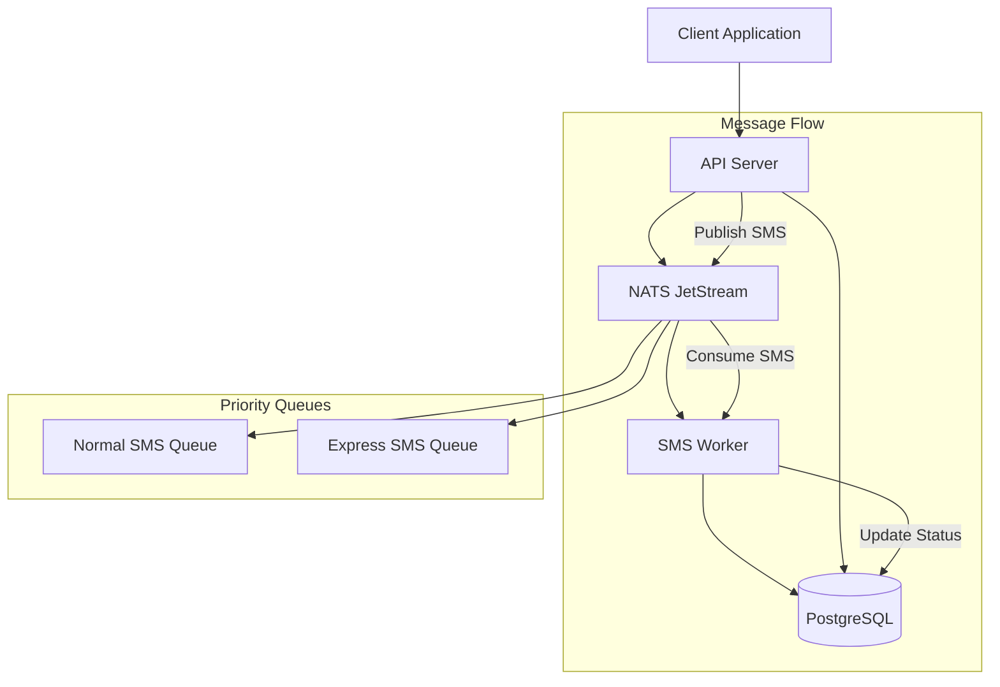
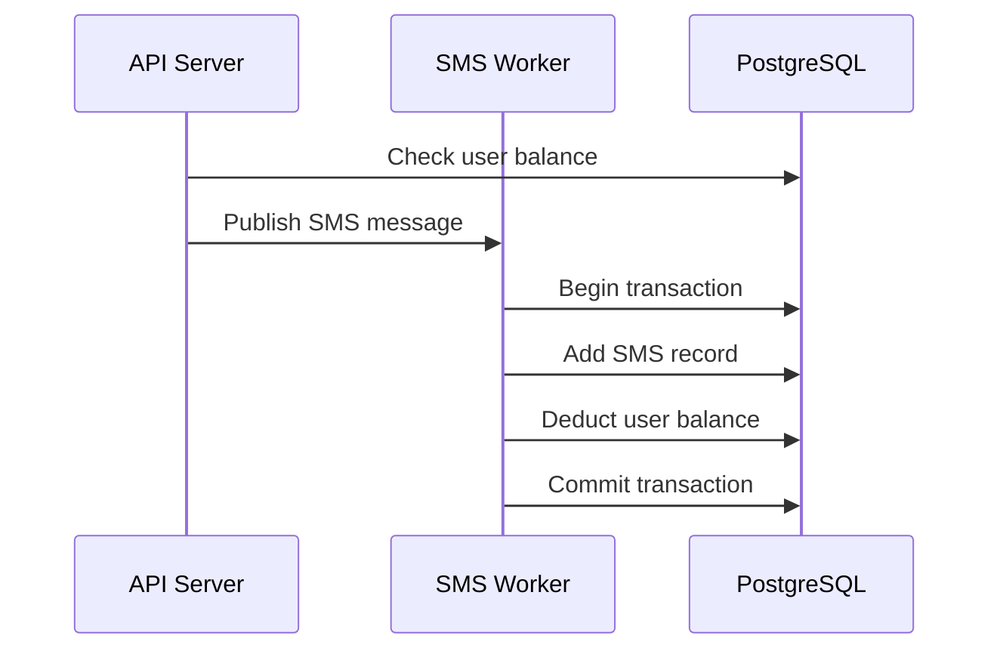
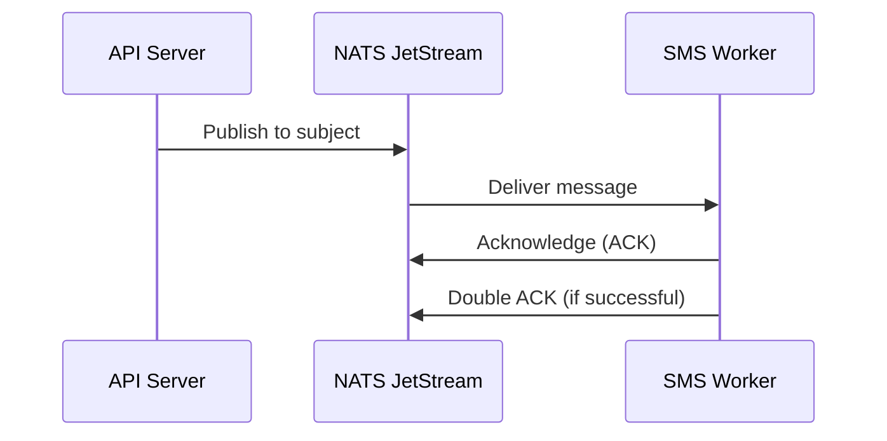

# Architecture Overview

## System Architecture

The SMS Gateway follows a **microservices architecture** with clear separation of concerns between the API layer and the message processing layer.

## Components

### 1. API Server (`cmd/api`)

**Purpose**: Provides REST API endpoints for SMS operations

**Responsibilities**:
- Handle HTTP requests for SMS sending
- Validate user balance before processing
- Publish SMS messages to NATS JetStream
- Manage user and phone number operations

**Key Features**:
- Gin-based HTTP server
- Balance validation
- Message publishing to priority queues
- Database connection management

### 2. Worker (`cmd/worker`)

**Purpose**: Background processing of SMS messages

**Responsibilities**:
- Consume messages from NATS JetStream
- Process SMS requests
- Update database with SMS records
- Deduct user balance
- Handle both normal and express SMS

**Key Features**:
- NATS JetStream consumer
- Transaction-based database operations
- Error handling and retry logic
- Priority-based message processing

## Message Flow

### Normal SMS Flow

1. **Client Request** → API Server receives POST `/sms`
2. **Validation** → Check user balance and validate request
3. **Publish** → Send message to `sms.send.request` subject
4. **Queue** → NATS JetStream queues message in `Sms` stream
5. **Consume** → Worker picks up message from queue
6. **Process** → Add SMS record to database and deduct balance
7. **Acknowledge** → Worker acknowledges message processing

### Express SMS Flow

1. **Client Request** → API Server receives POST `/sms?express=true`
2. **Validation** → Check user balance and validate request
3. **Publish** → Send message to `sms.ex.send.request` subject
4. **Queue** → NATS JetStream queues message in `SmsExpress` stream
5. **Consume** → Worker picks up message from high-priority queue
6. **Process** → Add SMS record to database and deduct balance
7. **Acknowledge** → Worker acknowledges message processing

## Data Flow

### Database Operations

### Message Queue Operations

## NATS JetStream Configuration

### Streams

1. **Normal SMS Stream** (`Sms`)
   - Subjects: `sms.send.*`
   - Retention: Work Queue Policy
   - Storage: File Storage

2. **Express SMS Stream** (`SmsExpress`)
   - Subjects: `sms.ex.send.*`
   - Retention: Work Queue Policy
   - Storage: File Storage

### Subjects

- `sms.send.request` - Normal SMS requests
- `sms.send.status` - Normal SMS status updates
- `sms.send.error` - Normal SMS errors
- `sms.ex.send.request` - Express SMS requests
- `sms.ex.send.status` - Express SMS status updates
- `sms.ex.send.error` - Express SMS errors

## Error Handling

### API Level
- Input validation errors (400)
- Insufficient balance (403)
- Internal server errors (500)

### Worker Level
- Message parsing errors → Terminate message
- Database errors → NAK with delay for retry
- Transaction failures → Rollback and retry

### NATS Level
- Connection failures → Retry with exponential backoff
- Message delivery failures → NAK with delay
- Consumer errors → Log and continue

## Scalability Considerations

### Horizontal Scaling
- **API Servers**: Multiple instances behind load balancer
- **Workers**: Multiple worker instances for parallel processing
- **NATS**: Clustered NATS servers for high availability

### Performance Optimization
- **Connection Pooling**: PostgreSQL connection pools
- **Message Batching**: NATS JetStream batch processing
- **Caching**: User balance caching (future enhancement)

## Security Considerations

### API Security
- Input validation and sanitization
- Rate limiting (future enhancement)
- Authentication/Authorization (future enhancement)

### Data Security
- Database connection encryption
- NATS connection security (future enhancement)
- Sensitive data encryption (future enhancement)

## Monitoring and Observability

### Logging
- Structured logging with Logrus
- Different log levels (Debug, Info, Error)
- Request/response logging

### Metrics (Future Enhancement)
- SMS processing metrics
- Queue depth monitoring
- Database performance metrics
- API response time metrics

## Deployment Architecture

The system is designed for Kubernetes deployment with:
- **Helm Charts**: For NATS and PostgreSQL
- **ConfigMaps**: For configuration management
- **Secrets**: For sensitive data
- **Services**: For service discovery
- **Ingress**: For external access