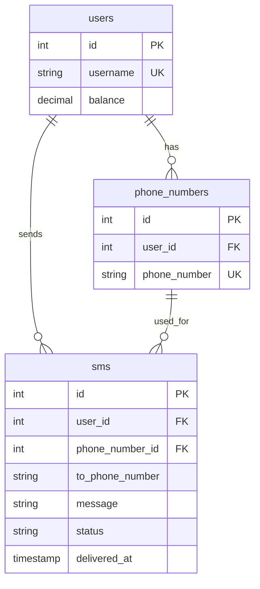

# Database Schema

## Overview

The SMS Gateway uses PostgreSQL as its primary database with a simple schema designed for user management, phone number management, and SMS tracking.

## Schema Definition

The complete schema is defined in `schema.sql`:

```sql
CREATE SCHEMA IF NOT EXISTS public;

CREATE TABLE IF NOT EXISTS users (
    id SERIAL PRIMARY KEY,
    username VARCHAR(255) NOT NULL UNIQUE,
    balance DECIMAL(10, 2) DEFAULT 0
);

CREATE TABLE IF NOT EXISTS phone_numbers (
    id SERIAL PRIMARY KEY,
    user_id INT NOT NULL REFERENCES users (id),
    phone_number VARCHAR(255) NOT NULL UNIQUE
);

CREATE TABLE IF NOT EXISTS sms (
    id SERIAL PRIMARY KEY,
    user_id INT NOT NULL REFERENCES users (id),
    phone_number_id INT NOT NULL REFERENCES phone_numbers (id),
    to_phone_number VARCHAR(255) NOT NULL,
    message VARCHAR(255) NOT NULL,
    status VARCHAR(255) NOT NULL DEFAULT 'pending',
    delivered_at TIMESTAMP NOT NULL DEFAULT CURRENT_TIMESTAMP
);
```

## Tables

### users

Stores user account information and balance.

| Column | Type | Constraints | Description |
|--------|------|-------------|-------------|
| `id` | SERIAL | PRIMARY KEY | Auto-incrementing user ID |
| `username` | VARCHAR(255) | NOT NULL, UNIQUE | Unique username |
| `balance` | DECIMAL(10,2) | DEFAULT 0 | User's account balance |

**Indexes**:
- Primary key on `id`
- Unique index on `username`

**Relationships**:
- One-to-many with `phone_numbers`
- One-to-many with `sms`

### phone_numbers

Stores phone numbers associated with users.

| Column | Type | Constraints | Description |
|--------|------|-------------|-------------|
| `id` | SERIAL | PRIMARY KEY | Auto-incrementing phone number ID |
| `user_id` | INT | NOT NULL, FOREIGN KEY | Reference to users.id |
| `phone_number` | VARCHAR(255) | NOT NULL, UNIQUE | Phone number string |

**Indexes**:
- Primary key on `id`
- Foreign key on `user_id` → `users.id`
- Unique index on `phone_number`

**Relationships**:
- Many-to-one with `users`
- One-to-many with `sms`

### sms

Stores SMS message records and delivery status.

| Column | Type | Constraints | Description |
|--------|------|-------------|-------------|
| `id` | SERIAL | PRIMARY KEY | Auto-incrementing SMS ID |
| `user_id` | INT | NOT NULL, FOREIGN KEY | Reference to users.id |
| `phone_number_id` | INT | NOT NULL, FOREIGN KEY | Reference to phone_numbers.id |
| `to_phone_number` | VARCHAR(255) | NOT NULL | Destination phone number |
| `message` | VARCHAR(255) | NOT NULL | SMS message content |
| `status` | VARCHAR(255) | NOT NULL, DEFAULT 'pending' | Delivery status |
| `delivered_at` | TIMESTAMP | NOT NULL, DEFAULT CURRENT_TIMESTAMP | Timestamp of record creation |

**Indexes**:
- Primary key on `id`
- Foreign key on `user_id` → `users.id`
- Foreign key on `phone_number_id` → `phone_numbers.id`

**Relationships**:
- Many-to-one with `users`
- Many-to-one with `phone_numbers`

## Entity Relationship Diagram



## Data Types

### SERIAL
- Auto-incrementing integer
- Equivalent to `INTEGER` with `AUTO_INCREMENT`
- Used for primary keys

### VARCHAR(255)
- Variable-length string up to 255 characters
- Used for usernames, phone numbers, and messages

### DECIMAL(10,2)
- Fixed-point decimal number
- 10 total digits, 2 after decimal point
- Used for balance amounts

### INT
- 32-bit integer
- Used for foreign key references

### TIMESTAMP
- Date and time value
- Defaults to current timestamp
- Used for delivery tracking

## Generated Code

The project uses [SQLC](https://sqlc.dev/) to generate type-safe Go code from SQL queries.

### Generated Files

- `sqlc/db.go`: Database connection and transaction management
- `sqlc/models.go`: Go struct definitions for database tables
- `sqlc/queries.sql.go`: Generated query functions

### Example Generated Structs

```go
type User struct {
    ID       int32           `db:"id" json:"id"`
    Username string          `db:"username" json:"username"`
    Balance  pgtype.Numeric  `db:"balance" json:"balance"`
}

type PhoneNumber struct {
    ID          int32  `db:"id" json:"id"`
    UserID      int32  `db:"user_id" json:"user_id"`
    PhoneNumber string `db:"phone_number" json:"phone_number"`
}

type Sm struct {
    ID            int32     `db:"id" json:"id"`
    UserID        int32     `db:"user_id" json:"user_id"`
    PhoneNumberID int32     `db:"phone_number_id" json:"phone_number_id"`
    ToPhoneNumber string    `db:"to_phone_number" json:"to_phone_number"`
    Message       string    `db:"message" json:"message"`
    Status        string    `db:"status" json:"status"`
    DeliveredAt   time.Time `db:"delivered_at" json:"delivered_at"`
}
```

## SQL Queries

The project includes predefined SQL queries in `queries.sql`:

### User Operations
- `AddBalance`: Add funds to user account
- `GetBalance`: Retrieve user balance
- `SubBalance`: Deduct funds from user account

### Phone Number Operations
- `AddPhoneNumber`: Add phone number to user
- `GetPhoneNumbers`: Retrieve user's phone numbers

### SMS Operations
- `AddSms`: Add SMS record to database
- `GetSms`: Retrieve SMS records

## Database Configuration

### Connection Parameters

Configured in `SmsGW.yaml`:

```yaml
api:
  postgres:
    address: "127.0.0.1"
    port: 5433
    username: root
    password: 1234

worker:
  postgres:
    address: "127.0.0.1"
    port: 5433
    username: root
    password: 1234
```

### Connection Pool

The application uses `pgxpool` for connection pooling:

```go
pool, err := pgxpool.New(context.Background(), 
    fmt.Sprintf("postgresql://%s:%s@%s:%d",
        username, password, address, port))
```

## Migration Strategy

Currently, the schema is created using `CREATE TABLE IF NOT EXISTS` statements, which means:

- Tables are created if they don't exist
- No automatic migrations for schema changes
- Manual schema updates required for modifications

### Future Enhancements

Planned improvements include:

- **Migration System**: Automated database migrations
- **Schema Versioning**: Track schema versions
- **Rollback Support**: Ability to rollback schema changes
- **Index Optimization**: Performance-optimized indexes
- **Partitioning**: Table partitioning for large SMS volumes
- **Archiving**: SMS message archiving strategy

## Performance Considerations

### Indexes

Current indexes:
- Primary keys on all tables
- Unique constraints on `username` and `phone_number`
- Foreign key indexes

### Recommended Additional Indexes

```sql
-- For SMS queries by user
CREATE INDEX idx_sms_user_id ON sms(user_id);

-- For SMS queries by status
CREATE INDEX idx_sms_status ON sms(status);

-- For SMS queries by delivery time
CREATE INDEX idx_sms_delivered_at ON sms(delivered_at);

-- Composite index for user SMS queries
CREATE INDEX idx_sms_user_status ON sms(user_id, status);
```

### Query Optimization

- Use prepared statements (handled by SQLC)
- Connection pooling for concurrent access
- Transaction management for data consistency
- Batch operations for bulk SMS processing

## Backup and Recovery

### Backup Strategy

```bash
# Full database backup
pg_dump -h localhost -p 5433 -U root sms_db > backup.sql

# Schema-only backup
pg_dump -h localhost -p 5433 -U root --schema-only sms_db > schema.sql

# Data-only backup
pg_dump -h localhost -p 5433 -U root --data-only sms_db > data.sql
```

### Recovery Strategy

```bash
# Restore from backup
psql -h localhost -p 5433 -U root sms_db < backup.sql
```

## Security Considerations

### Data Protection
- Sensitive data encryption (future enhancement)
- Database connection encryption
- Access control and user permissions

### SQL Injection Prevention
- SQLC generates type-safe queries
- Parameterized queries prevent SQL injection
- Input validation at API level